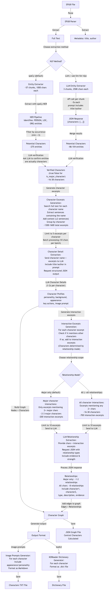

# EPUB Character Graph Documentation

This directory contains documentation for the EPUB Character Graph project.

## Documentation Files

- [Original Design](./Original%20Design.md) - The original design document
- [Improvements](./IMPROVEMENTS.md) - Recent improvements to the project
- [Centrality Fix](./CENTRALITY_FIX.md) - Details on centrality calculation fixes
- [Interaction Counts Fix](./INTERACTION_COUNTS_FIX.md) - Details on interaction count tracking
- [Pending Issues](./PENDING_ISSUES.md) - Known issues and planned work
- [Series Support](./SERIES_SUPPORT.md) - Implementation plan for series support

## System Architecture

The system is designed to extract character information from EPUB files, build a relationship graph, 
and generate various outputs such as image prompts or dictionaries.